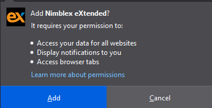
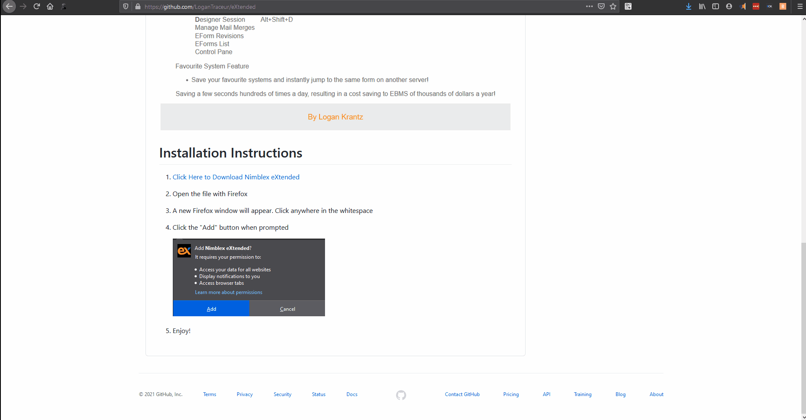

[mylink]: <https://github.com/LoganTraceur/eXtended/raw/main/Versions/nimblex_extended-8.2-fx.xpi> "Install Nimblex Extended"

# Nimblex eXtended

# Features
### 1. Save Time with Keyboard Shortcuts to open design sessions, new records and tabular reports
### 2. Right Click Context Menu allows you to navigate in Nimblex like a ninja
### 3. Quick Cluster Login allows you to spend less time logging in and more time being a professional boss
### 4. Auto Redirect After Cluster Login (Finally the links clients send work for us first time!)
### 5. Favourite your most used systems
#### Link to Quickly Log into your favourite systems
#### Navigate to the same eform in a different instance (Perfect for CORE systems)

# Installation Instructions

1. [Click Here to Download Nimblex eXtended][mylink]
2. Open the file with Firefox
3. A new Firefox window will appear. Click anywhere in the whitespace
3. Click the "Add" button when prompted

      
 
 4. Enjoy!

  

